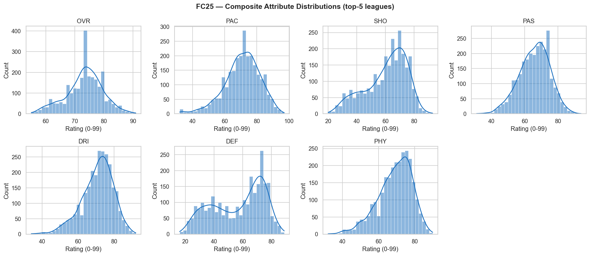
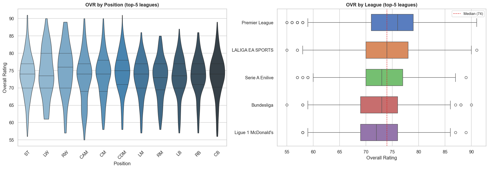
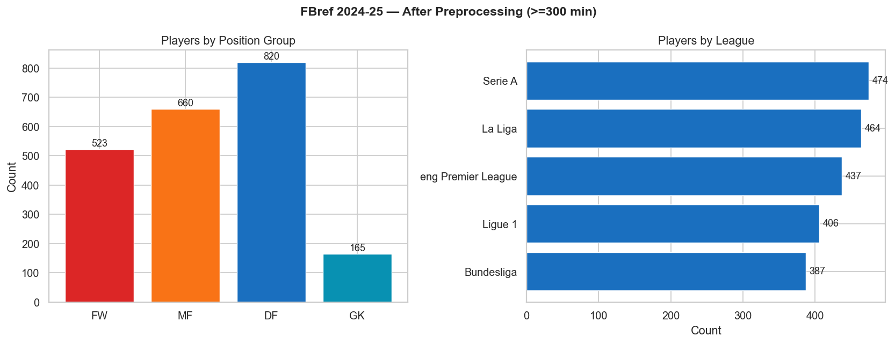
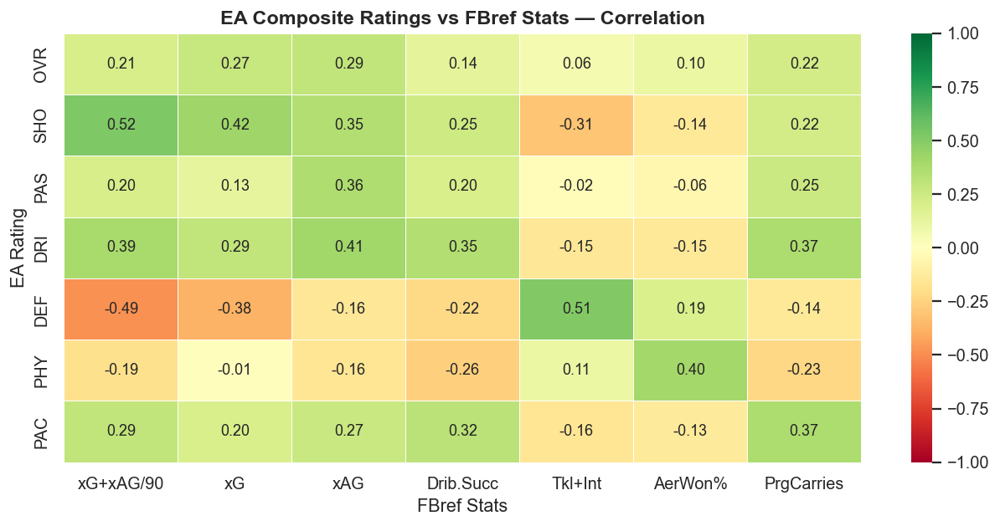
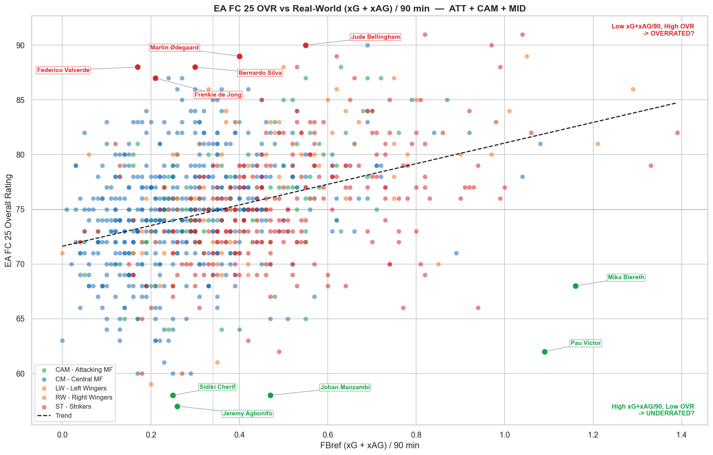

# Milestone 1

## Datasets

To bridge the gap between EA's scores and real-world performance, we combined two complementary datasets: one containing the ratings EA assigned to players at the start of the 2024–25 season, the other documenting what they went on to produce on the pitch.

### 1. EA FC 25 Ratings (`fc25_players.csv`)

> **Source:** [EA Sports FC 25 Database, Ratings and Stats](https://www.kaggle.com/datasets/nyagami/ea-sports-fc-25-database-ratings-and-stats)

This dataset covers **17,737 players** across **56 columns**, including identity data (age, club, nation, position), 7 core composite ratings (`OVR`, `PAC`, `SHO`, `PAS`, `DRI`, `DEF`, `PHY`) on a 0–99 scale, 29 individual sub-attributes, and 5 goalkeeper-specific ratings.

The rating process relies on a global network of volunteer reviewers who assess players by eye; raw stats inform but do not dictate the outcome. The final score then layers on positional weighting, league modifiers, and a reputation bonus of up to +3. This is exactly the kind of bias our project tries to quantify.

> *Preprocessing: parsed height/weight into numeric cm/kg, separated GK and outfield subsets, tokenized playstyle tags. Restricted to top-5 male leagues to match FBref scope.*

### 2. Real 2024–25 Stats (`players_data-2024_2025.csv`)

> **Source:** [Football Players Stats 2024–2025](https://www.kaggle.com/datasets/hubertsidorowicz/football-players-stats-2024-2025)

Drawn from FBref, one of the most comprehensive and respected public sources of professional football data, this dataset covers **2,854 players** from the top 5 European leagues. It merges 9 FBref statistical tables into 267 columns, reduced to **170 usable columns** after removing redundant identity fields.

FBref goes well beyond goals and assists, offering advanced metrics tailored to each position: xG (expected goals) and shot-creating actions for attackers, progressive carries and defensive duels for outfield players, and Post-Shot xG for goalkeepers. These position-specific metrics make FBref a natural counterpart to EA's composite ratings.

> *Preprocessing: we dropped 97 duplicate columns, filtered players under 300 min played (−24%, 686 rows), standardized nationality codes, mapped FBref positions to EA equivalents.*

---

## Problematic

Every summer, EA Sports drops a new edition of FC, and for millions of players the most anticipated moment isn't the gameplay: it's the ratings. That number next to a player's name carries real weight, in the game and beyond. But it isn't purely a measure of what a player did last season. EA factors in positional weightings, league modifiers, and an international reputation bonus of up to +3 points, all assessed by a global network of volunteer scouts. A player's marketability, fame, and legacy quietly shape their rating alongside their performances. This project asks a simpler question: **once the season was done, which players actually justified their rating, and which ones either coasted on reputation or deserved far better?**

The core axis of this visualization is what we call the "Reputation Gap": the distance between a player's perceived value as captured by their EA Overall Rating, and their actual on-pitch output as measured by advanced metrics such as expected goals, progressive carries, and defensive actions. This lets us identify two distinct profiles: on one end, legacy stars whose ratings significantly outpace their real 2024–25 production; on the other, highly efficient players who deliver elite numbers but remain conservatively rated because they are less famous or play for smaller, less marketable clubs.

Video game ratings shape how millions of fans perceive real-life players, often more than the stats do. Our goal is to cut through that noise using advanced football data, and to show visually how reputation, league prestige, and marketability can distort the evaluation of modern athletes. The visualization is designed for football fans, FC 25 gamers, and sports data enthusiasts alike: a way to explore which players are over- or under-valued, using a rating system that most fans already understand.

---

## Exploratory Data Analysis

### Rating distributions

Restricted to the top-5 male leagues (2,612 players), FC 25 OVR (Overall Rating) is right-skewed (mean 73.3, median 74, σ 6.4): only 2.3% of players exceed 85. Among the seven composites, `PAC` leads (mean 70.8) while `DEF` has the lowest mean (56.7) and widest spread (σ 17.9), positional variance that makes position-aware normalization essential.

*Figure 1: Distribution of the 7 composite ratings. `DEF` stands out for its high variance, driven by the contrast between defenders and forwards.*

*Figure 2: OVR by position and league in the top-5 male leagues; IQR 70–77, mean 73.3, median 74, with only 2.3% exceeding 85.*

### Real-world stats

After the 300-minute filter, 2,168 players remain across the top 5 leagues (DF 38%, MF 30%, FW 24%, GK 8%) with league sizes between 387 and 474. Goals and assists are zero-inflated (median = 0), as expected in a defender-heavy sample. xG and actual goals correlate at r = 0.93, validating data quality.

*Figure 3: Player distribution by broad position group and by league (300-min filter). Defenders dominate the sample, informing our choice to normalize statistics by position group.*

### Dataset overlap

Fuzzy name matching (with manual overrides for edge cases) yields **2,023 confirmed pairs, 93.3%** of the FBref sample. The remaining 145 gaps stem from mid-season transfers, and genuine FC 25 absences.

### Preliminary correlations and outliers

Cross-dataset analysis confirms clear "signal pairs" that validate our data:
* **Shooting/Goal-Scoring**: EA `SHO` correlates strongly with real-world **Expected Goals** (`xG`), validating that high-rated virtual finishers generally reach high-quality scoring chances.
* **Defensive Skill**: The EA `DEF` rating shows the strongest alignment with actual defensive output, specifically **Tackles + Interceptions** (`Tkl+Int`).

Conversely, some traits lack a direct statistical match. **Speed** (`PAC`), for instance, only shows a weak link to **Progressive Carries**, reinforcing the need for position-specific analysis rather than a universal metric.

*Figure 4: Cross-dataset correlation heatmap. The `SHO`/`xG` and `DEF`/`Tkl+Int` pairs are the strongest signals.*

Mapping Overall Rating against attacking productivity (`xG+xAG/90`: expected goals + expected assists per 90 min) highlights two kinds of outliers: big names whose ratings clearly exceed their 2024–25 output, and productive mid-table players who put up strong numbers but stay conservatively rated.

*Figure 5: OVR vs xG+xAG/90 scatter for attackers and midfielders, surfacing established stars and underrated mid-table players.*

---

## Related Work

The FC 25 Kaggle dataset has primarily been used for attribute-level EDA and in-game rating prediction: [this notebook by devraai](https://www.kaggle.com/code/devraai/ea-sports-fc-25-player-data-analysis-and-predic) predicts OVR using ML, and [the dataset author's own EDA](https://www.kaggle.com/code/nyagami/exploratory-data-analysis-of-the-fc-25-dataset) explores distributions both without any real-world performance reference. No existing work crosses the two datasets. Community tools like [SoFIFA](https://sofifa.com) and [FUTWIZ](https://www.futwiz.com) let users browse ratings, while [FBref](https://fbref.com) and [Sofascore](https://www.sofascore.com) offer per-90 dashboards, but each operates in isolation with no shared frame between gaming perception and on-pitch reality.

Rather than comparing players to one another, we use the EA rating as a proxy for public perceived value and pit it against positional-normalised real-world efficiency metrics. This produces a directional "Reputation Gap" that surfaces overrated legacy stars and underrated hidden gems within a single framework, which, to our knowledge, no existing tool does. [Prior ML work on FIFA ratings](https://brentclaypool.com/2021/06/03/machine-learning-analysis-of-ea-sports-fifa/) explicitly identified bias introduced by past-season performance as an unresolved problem; our cross-dataset approach directly addresses it.

The main scatter (`OVR` vs `xG+xAG/90`, trend line, labeled outliers) draws from three visual references: [Flourish's football scatter](https://flourish.studio/blog/world-cup-euros-football-data-visualization/) uses the same expected-vs-actual structure with annotations; the [NYC Data Science player value analysis](https://nycdatascience.com/blog/student-works/identifying-overvalued-and-undervalued-soccer-players-relative-to-in-season-performance/) classifies players by residual distance from a trend line; and [Soccerment's hidden gems](https://soccerment.com/looking-for-hidden-gems/) plots performance against salary to surface undervalued players by position.
