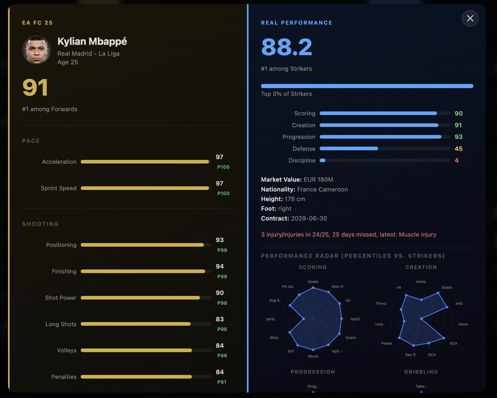
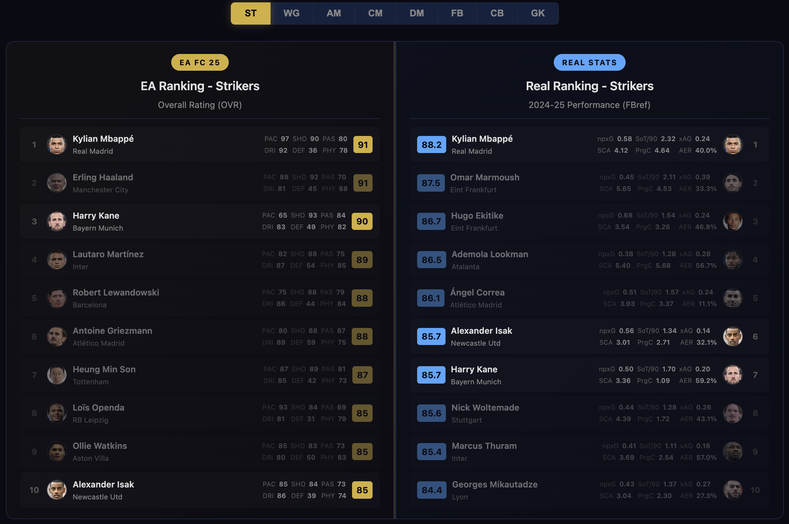
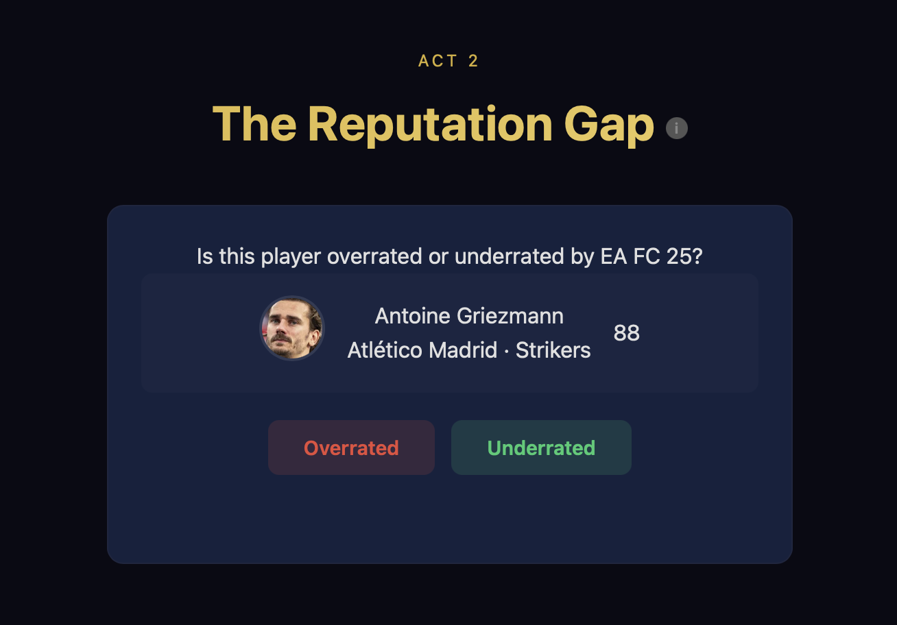
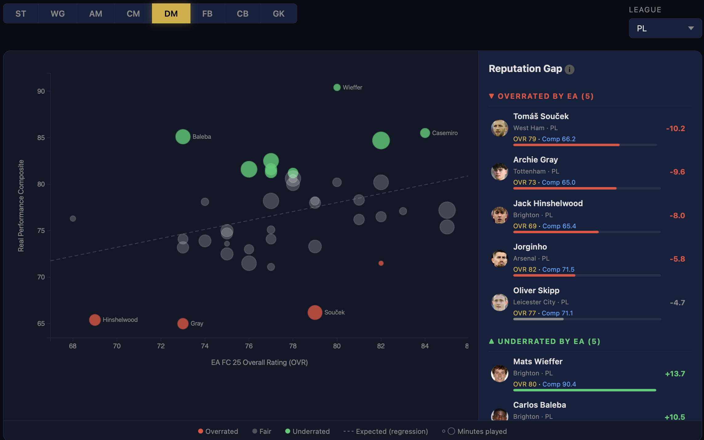
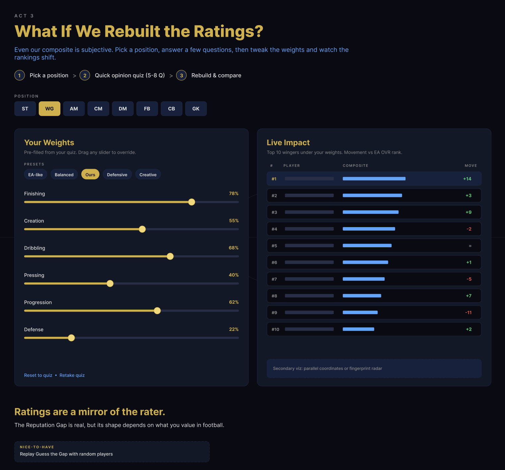

# Milestone 2 - The Reputation Gap

## Project Goal

**The Reputation Gap** is a data visualization project that questions one of football's most widely trusted numbers: the EA FC 25 Overall Rating.

Every summer, EA Sports releases ratings for thousands of professional footballers. For millions of fans and gamers, these numbers define how good a player "is." But EA's ratings aren't purely built on last season's statistics, they factor in reputation, marketability, and the judgment of volunteer scouts worldwide. A legendary player coasting through their final seasons can still carry a rating that their recent performances no longer justify. Meanwhile, a quietly excellent midfielder at a mid-table club might put up elite numbers while staying conservatively rated, simply because fewer people are watching.

This project puts those two things side by side: EA's perceived value on one hand, and real 2024–25 match data from FBref on the other. Using ~1,700 matched players with more than 600 minutes played across the top 5 European leagues, we compute a position-specific composite performance score from advanced metrics (Expected Goals, progressive carries, defensive actions, etc.) and compare it directly to each player's EA OVR. The gap between the two is what we call the **Reputation Gap**, a directional signal that surfaces who's overrated, who's underrated, and how much reputation distorts the way we see modern footballers.

The story unfolds in three acts :

**Act 1** shows the two worlds side by side: who EA thinks the best players are, and who the data says they are.

**Act 2** zooms into the gap itself : a scatter plot where every dot is a player, and distance from the trend line is the story. 

**Act 3** lets users rebuild the ratings themselves by adjusting the weights of each performance dimension.

## Visualizations

### Act 1: The Comparison

Act 1 presents two ranked lists at once: the top 10 players by EA OVR on the left, and the top 10 players by real 2024–25 performance on the right. Both lists are filtered by sub-position (Strikers, Wingers, Central Midfielders, etc.) so the comparison is always fair (e.g defenders aren't ranked against attackers).

The real-world composite score is built by percentile-ranking each relevant FBref stat within the same sub-position, then combining them as a weighted average rescaled to the EA OVR distribution. This makes the two columns directly and easily comparable, even though they come from completely different sources.

The key interaction is the **player modal**: clicking any card opens a detailed profile showing the player's EA composite ratings alongside their real-world percentiles, displayed as a "radar chart". This lets users go beyond the headline number and see *why* a player ranks where they do, whether it's finishing, creativity, or defensive output.

The visual design uses a split-screen layout with a clear left/right separation between the EA world and the real-stats world. Animated lines connecting the same player across both lists (when they appear in both) reinforce where the rankings agree and make the gaps impossible to miss when they don't.

### Act 2: The Reputation Gap

Act 1 lets users see that the two ranking systems disagree, but it only shows the top of each list. Act 2 plots every player at once and turns the disagreement into a measurable quantity: the Reputation Gap.

Before showing the data, we engage the user with a short **Guess the Gap** warm-up. A card appears with a player's photo, name, club, sub-position and EA OVR — but not their real composite. The user is asked a simple question: *"Is this player overrated or underrated by EA FC 25?"* Two buttons let them commit to a guess before the answer is revealed. The examples are chosen to be surprising (Griezmann turns out overrated; Marmoush turns out underrated), which primes the user to question their own assumptions before they see the full picture.

The core visualization is an **interactive scatter plot**. Each dot is a player: the horizontal axis is their EA OVR, the vertical axis is their real-performance composite score. A dashed regression line fitted per sub-position represents what we call the *expected composite* — the real output you would predict from a given OVR if EA's ratings were perfectly calibrated. Distance from this line is the Reputation Gap: players above the line outperform their rating (underrated by EA), players below it underperform (overrated). Dots are color-coded accordingly — green for underrated, red for overrated, grey for players near the trend line whose rating is roughly fair. Dot size encodes minutes played, so that the most reliable data points (full-season regulars) are visually prominent while low-sample players remain visible but smaller. Outlier names are labeled directly on the chart to anchor the reader's attention on the most extreme cases.

The chart is controlled by two filters. A **sub-position toggle** (ST, WG, AM, CM, DM, FB, CB, GK) restricts the view to a single role, which also updates the regression line and the gap calculation to be position-specific — a fair comparison, since what counts as a good score for a striker is very different from what counts for a centre-back. A **league dropdown** further narrows the selection to one of the five leagues (Premier League, La Liga, Serie A, Bundesliga, Ligue 1) or shows all leagues at once. Both filters update the chart, the regression and the sidebar in real time.

The **sidebar** complements the scatter by surfacing the most extreme cases for the current filter. It lists the top 5 overrated and top 5 underrated players, each shown with their photo, name, club, EA OVR, composite score and a colored bar indicating the magnitude of the gap. Hovering over a sidebar entry highlights and enlarges the corresponding dot on the scatter, and conversely, hovering over a dot on the scatter reveals a tooltip with the player's full profile. This two-way interaction lets the user move fluidly between the aggregate view and individual cases.

### Act 3: Rebuild the Ratings

Act 3 addresses a limitation of Act 2: our composite score is not objective either. We fixed the weights of each performance dimension when defining the composite, and a different analyst would likely have chosen different weights based on their own view of the game. Whether a winger should be judged primarily on finishing or on creation, or whether a centre-back should be measured on defensive actions or on ball progression, is a matter of opinion rather than fact. Act 3 therefore hands the weights over to the user and lets them rebuild the ranking under their own assumptions.

The interaction follows four steps:

1. **Position selection.** The user selects a sub-position (striker, winger, central midfielder, full-back, etc.) by clicking the corresponding slot on an interactive line-up, similar to a team sheet in a EA FC.
2. **Opinion quiz.** Rather than exposing raw sliders directly, we first ask the user a short set of non-technical questions about how they view the selected role. Each answer is silently mapped to an adjustment of the underlying weights, so that the user ends up with a personalized profile without having to understand the metrics in detail. Example questions:
   - "You can only sign one winger: the one who scores 20 goals a season, or the one who sets up 20?"
   - "Your ideal central midfielder: the one who never loses the ball, or the one who always tries the killer pass?"
3. **Weight sliders, preset profiles and ideal-profile view.** The weights derived from the quiz are then exposed as editable sliders, so that the user can still refine them manually. The panel also offers preset profiles for comparison: "EA-like" (weights reverse-engineered from EA's own ratings), "Balanced", "Ours" (our Act 2 composite), and a few archetypes such as "Defensive" or "Creative". Alongside the sliders, we display a ternary plot of the user's ideal profile: for positions where three attributes clearly dominate (for example Finishing, Creation and Dribbling for a winger), every real player is plotted inside a triangle according to their actual profile, and the user's own weight configuration is plotted as a marker inside the same triangle. This lets the user visually identify which real players sit closest to their ideal profile as they adjust the sliders.
4. **Live impact panel.** On the right side of the screen, the consequences of the current weights are displayed in real time and update whenever the user drags a slider. The panel is organized as a sequence of pages that the user can flip through using `<` and `>` arrows, which lets us offer several complementary views of the same data without crowding the layout. The default page shows a re-ranked top list for the selected position together with a highlight of the biggest movers; the other pages are candidate visualizations described below.

Act 3 closes the narrative of the project. The Reputation Gap identified in Act 2 is real and measurable, but its exact shape depends on what the viewer values in football. A rating is therefore as much a reflection of the person who produced it as it is of the player being rated.

**Candidate pages for the live impact panel.** If we commit to the slider-based layout described above, the following views are the options we are considering to expose through the paginated right-hand panel. Two of them are visual callbacks to the earlier acts, so that the user encounters familiar charts now redrawn under their own weights:

- **Act 2 callback, live scatter plot.** The scatter from Act 2 is reused, but its composite axis recomputes as the user adjusts the sliders, causing the dots to slide in real time. This reinforces the continuity between the two acts and makes the effect of the user's choices immediately visible.
- **Act 1 callback, split-screen ranking.** The two-column layout from Act 1 is reused, this time with the user's own top 15 on the right instead of the FBref composite. Lines connecting each player across the two columns turn the view into a bump chart, making it easy to read who climbed and who dropped.
- **Divergent bar chart of gaps.** Each player is represented by a horizontal bar starting from a vertical zero line: red to the left for overrated players, green to the right for underrated ones, sorted by gap magnitude. The chart reorders itself whenever the weights change.

## Tools and Relevant Lectures

| Block | Tools | Relevant Lectures |
|---|---|---|
| Global layout: landing page, scrollytelling between acts, ball-button navigation | HTML, CSS, SVG, Vanilla JS, Scrollama, GSAP | Web dev; Javascript; More Javascript; Interaction; Designing viz; Storytelling |
| Act 1, Two Worlds: split-screen rankings with 8-position toggle, player modal with percentile bars and radar chart | D3.js, SVG, Vanilla JS | D3; More interactive D3; Marks and channels; Perception and colors; Tabular data; Interaction |
| Act 2, The Reputation Gap: Guess the Gap intro, main scatter (OVR vs composite, regression, gap color encoding), filters, top over/underrated sidebar | D3.js, Vanilla JS | Tabular data; D3; More interactive D3; Marks and channels; Perception and colors; Dos and don'ts; Storytelling |
| Act 3, Rebuild the Ratings: line-up position picker, opinion quiz, weight sliders with presets, ternary plot of ideal profile, paginated live impact panel | D3.js, SVG, Vanilla JS | Interaction; More interactive D3; Marks and channels; Perception and colors; D3; Designing viz |
| Data pipeline: scraping, EA ↔ FBref fuzzy name matching, per-position composite score | Python (pandas, numpy, rapidfuzz) | Data |

### Extra Ideas (enhancements, can be dropped)

- **Non-predetermined "Guess the Gap" mini-game.** At the very end of Act 3, after the user has built their own weights, we replay the Act 2 intro game but with randomly sampled players instead of the two fixed examples, so the user can test their intuition against real gaps they have not seen before.
- **Extra leagues beyond the top 5.** Extend the dataset to Portugal, the Netherlands, Belgium, the Saudi Pro League, etc. This requires an additional data source since FBref only covers the top 5 European leagues.
- **Age and career-stage overlay on the scatter plot.** Color or size the dots by age bracket to test the "legendary players coasting on reputation" hypothesis visually. Does the gap skew older for the overrated side?
- **Contextual callouts on counter-intuitive results.** Explain why certain position rankings look odd at first glance. For example, star defenders and goalkeepers from dominant clubs (Van Dijk, Marquinhos, etc.) tend to look surprisingly *weak* in the composite: because their team keeps the ball and concedes very few chances, they simply have fewer defensive actions to perform per 90, while defenders at smaller clubs face 20 shots a game and pile up tackles, blocks and saves. Surfacing these team-level effects as inline annotations would prevent users from mistaking a context artifact for a real performance signal.
- **Share your profile.** Let the user export the weight profile they built in Act 3 as a shareable link or image, so they can compare with friends.
- **Year-over-year rating drift (EA FC 25 to EA FC 26).** We can directly compare each player's new OVR on FC 26 with the gap we measured on the 2024-25 season. Did EA actually upgrade the players our composite flagged as most underrated, and downgrade the overrated ones? A retrospective check on whether the Reputation Gap predicts EA's own corrections.

## Functional Prototype

The website is live at: [link](https://com-480-data-visualization.github.io/Tito-Data-Viz/)

Current state: landing page, global ball-button navigation, and a first working pass of Acts 1 and 2 (split-screen rankings with player modal for Act 1, Guess the Gap intro plus interactive scatter with filters and over/underrated sidebar for Act 2). These are a base that will be refined and extended in M3. Data pipeline is done and served as static JSON.
